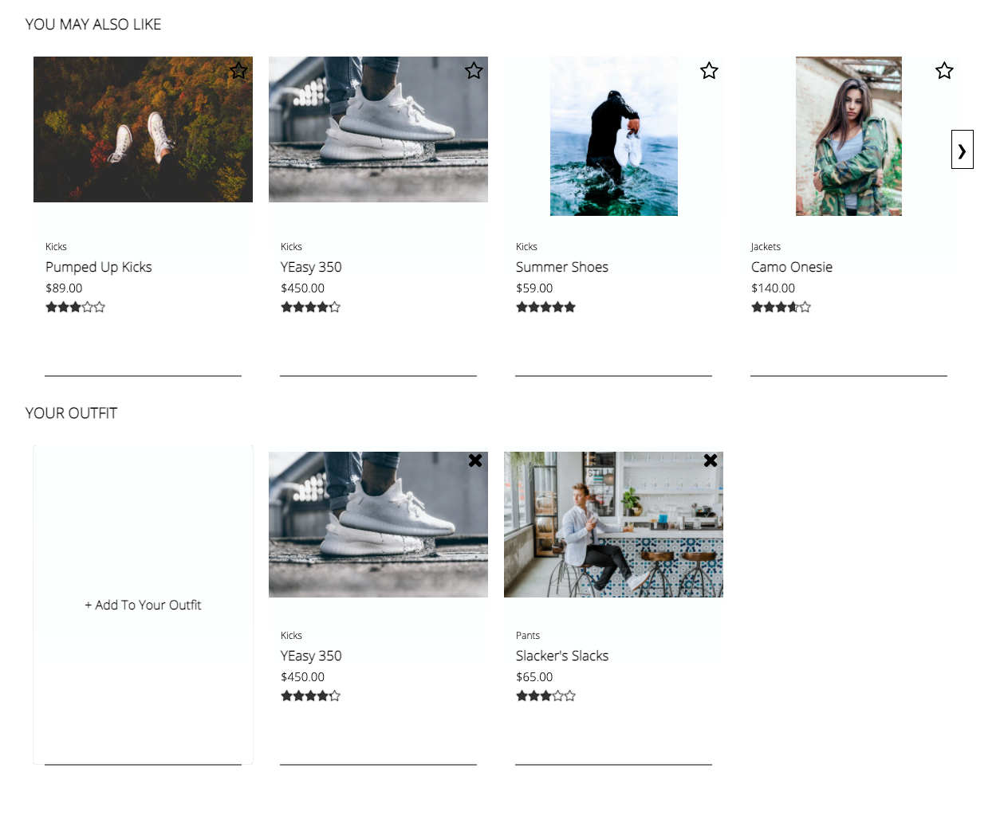

# FEC-ProjectCatwalk
Front End Capstone Project at Hack Reactor.

## Motivation

This project was designed to grow our understanding of building, maintaining, and optimizing a full react application. While the project was completed as a group, each individual was fully responsible for their own component. This allowed each of us to utilize and strengthen our understanding of front end development.

## Build status

[](https://github.com/Observant-Ostriches/fec-projectCatwalk)


## Component Details
### Main Product Overview

### Related Products and Your Outfit

Related Products displays product cards of similar items that may interest the user. This component includes:
  - Scrollable list of product cards
  - A feature comparison table
  - Conditionally rendered scroll buttons

Your Outfit allows users to save and track individual products based on their interest.This component includes:
  - Add to Outfit card which adds the current product to Your Outfit list
  - A delete card icon that removes the product from the list

For futher information and demos of these components please see:


### Questions & Answers

### Ratings & Reviews


Ratings and Reviews displays dynamically rendered client reviews and their ratings meta data for the selected product.
  - Server side caching system to reduce number of API requests to two upon page load
  - Star filtration functionality to designed to retrieve reviews of specific star rating
  - Scrollable list of reviews with conditionally rendered subcomponents


Review submission form with validation for client to rate products
  - Validation on client side preventing faulty reviews from being sent to server
  - Dynamically rendered subcomponents specific to product being reviewed

### Built With

* [React](https://reactjs.org/)
* [Node](https://nodejs.dev/)
* [Express](https://expressjs.com/)
* [Babel, Webpack]()
* [Jest, Enzyme, Webpack]()
* [Styled Components](https://styled-components.com/)

## Installation


To get a local copy up and running follow these simple steps:
###### Pre-Installation Requirements
    Node v14.15.1
    NPM v6.14.11
###### Instructions
1. Clone the repo
   ```sh
   git clone https://github.com/Observant-Ostriches/fec-projectCatwalk.git
   ```
2. Acquire a github personal access token to acquire access to the API. Insert token into example.config.js and rename file to config.js
3. Install NPM packages
   ```sh
   npm install
    ```
3. Compile Webpack
   ```sh
   npm run build
    ```
4. Start the server
   ```sh
   npm start
    ```
5. Navigate to localhost:3000

## Team

* Patrick McConnell - Rating and Reviews
  * https://github.com/pmcconnell13
  * https://www.linkedin.com/in/charlespatrickmcconnell

* Zachary Medellin - Questions and Answers
  * https://github.com/zacharymed44
  * https://www.linkedin.com/in/zachary-medellin

* Dana Walsh - Related Products
  * https://github.com/danaewalsh
  * https://www.linkedin.com/in/dana-walsh

* Ricky Zhao - Product Overview
  * https://github.com/rickBucket
  * https://www.linkedin.com/in/ricky-zhao

